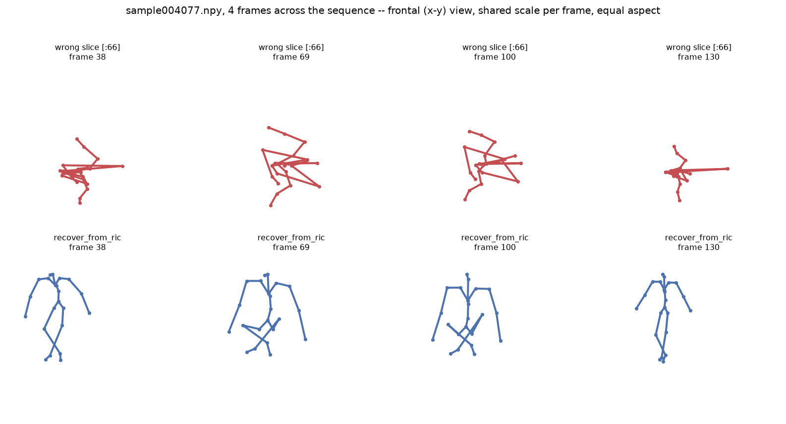
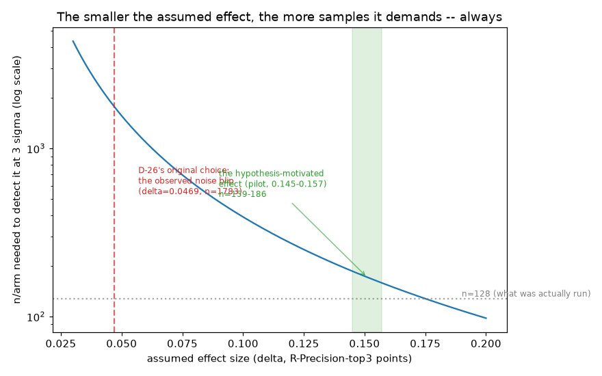

# T2P-Reboot — text-to-motion generation, built around measurement

Given a sentence like *"a person walks forward, then turns left,"* generate a 3D human motion
sequence that matches it. This project is a ground-up rebuild of that problem, with one rule
above all others: **no claim of quality without a number to back it, and no number without the
code that produced it sitting right next to the claim.**

That discipline is the actual product here, as much as any model. It shows up most clearly in
the notebooks below.

---

## The notebooks — the core of this project

Every notebook answers exactly one question, end to end: the question, the intuition behind it,
the measurement, and what it means — with every number computed live in the notebook itself,
never pasted in from a prior run. Nine questions asked and answered so far.

  

1. **[Does a subtly wrong way of reading 3D pose data look fine, or does it show?](notebooks/03_263d_representation_and_f1_bug.ipynb)**
   It looks completely fine — until you check that a bone's length stays constant across frames.
   The wrong decode fails that check by five orders of magnitude.

2. **[Is a standard motion-quality score (FID) trustworthy at small sample sizes?](notebooks/04_fid_covariance_rank_deficiency.ipynb)**
   No. Comparing real data against *equally real* data should score ~0; at 128 samples per side
   it scores **1.577**, falling to **0.109** at 2,000 — a **14x** swing driven by sample size
   alone. A fact about the metric, not about the motion.

3. **[Does a second, independent evaluator agree with the primary one?](notebooks/02_tmr_second_evaluator.ipynb)**
   Eventually, yes — but only after **four separate silent bugs** were found and fixed (one after
   this notebook had already been reviewed and closed twice), moving the primary evaluator's score
   from **0.352 to an exact 0.7578** — matching this project's own independently recorded target
   to the digit. Before the fixes the two evaluators looked *uncorrelated* (r = −0.006);
   afterwards they agree moderately (r = 0.328). Trusting a single evaluator without a cross-check
   would have shipped an exactly backwards conclusion.

4. **[Does the text encoder actually understand spatial language — "left," "right," "behind"?](notebooks/01_clip_spatial_blindness.ipynb)**
   No. Sentences differing only by *left* vs *right* sit measurably closer together than sentences
   differing by a comparable non-spatial word — **Cohen's d = 0.995**, n = 40 per group, clearing
   correction for multiple comparisons. And **57.6%** of this dataset's 24,503 captions contain
   spatial vocabulary. Not a rare edge case.

5. **[Is that blind spot caused by how the model reads CLIP's output, or is it inside CLIP itself?](notebooks/01b_pooling_probe.ipynb)**
   Inside CLIP itself. The gap is **wider** in CLIP's per-token features (+0.111) than in the
   pooled vector the model actually reads (+0.027) — so the obvious cheap fix, "stop pooling,"
   would not fix it. A negative result that saved the cost of finding out the expensive way.

6. **[Before comparing "spatial" vs. "non-spatial" captions, is that comparison even fair?](notebooks/05_spatial_subset_split.ipynb)**
   Not without care. Spatial captions run **41% longer** (14.38 vs 10.19 words, d = 0.592) — a
   difference that could easily be mistaken for a spatial-language effect. Found before any
   training run, at the cost of one notebook.

7. **[Could one specific training bug have quietly taught a model to ignore text completely?](notebooks/06_cfg_training_loss_collapse.ipynb)**
   Yes — demonstrated directly on a rebuilt version of the bug. The conditioning pathway never
   grows, and the broken objective converges to a **lower** training loss (0.090) than the correct
   one (~0.3), because it has a degenerate solution that ignores the text entirely. **The loss
   curve looks better while the model learns to ignore you** — exactly why a loss curve alone is
   never a result.

8. **[When two results differ by a handful of samples, is that a real effect?](notebooks/07_why_six_samples_is_not_a_finding.ipynb)**
   No. Rerunning the identical setup with **only the random seed changed** reproduces the same
   "effect" exactly: 38/128 vs 44/128, the same six-sample gap, from nothing but chance.

  

9. **[What do PyTorch and Apple's MPS backend get silently wrong, if you don't know to check?](notebooks/08_pytorch_mps_silent_failures.ipynb)**
   A craft notebook, not a motion one: nine real specimens — a broadcasting bug that trains
   anyway, a device-selection function that silently falls back to CPU, a fourth bug in the
   evaluator notebook above (#3) that two rounds of review had missed — each shown wrong-way-
   next-to-right-way, with the five habits that would have caught every one of them.

Full index with figures and status: **[notebooks/README.md](notebooks/README.md)**.

---

## The research record

Alongside the notebooks, this project keeps a written trail of *why*, not just *what* —
searchable, dated, and meant to be read by whoever picks this up next:

- **`docs/LANDMINES.md`** — a running catalogue of traps that produce a plausible wrong answer
  with no error message, each one caught and documented so it isn't repeated.
- **`docs/DECISIONS.md`** — every non-obvious design choice, with the reasoning behind it.
- **`docs/EXPERIMENT_LOG.md`** — every experiment run, including the ones that resolved to "not
  enough evidence either way" rather than a convenient story.
- **`docs/GLOSSARY.md`** — every term and acronym, defined once, the first time it appears.
- **`docs/EXPERIMENT_DESIGN_E2.md`** — the next experiment, fully specified and pre-registered
  before any of it runs: fixing CLIP's spatial blindness with a small adapter, tested against a
  built-in control for making anything else worse.

---

## What this rests on — stated plainly

Three things a reader should know before reading any number above.

**The generative model is not ours.** Where a trained text-to-motion model is needed — for the
demo, and as the baseline everything is measured against — this project uses the **released MDM
checkpoint** (Tevet et al., MIT-licensed), not a model trained here. That is deliberate: the
question being asked is about *measurement and conditioning*, and borrowing a known-good model
removes one variable. No full-scale training run has happened, and the status table below says so.

**The dataset came from an unofficial mirror.** HumanML3D is derived from AMASS, whose licence is
the reason the official repository ships *preprocessing scripts* rather than processed data. The
copy used here is a third-party HuggingFace re-upload with **no licence and no attribution**.
Integrity is strongly corroborated — ground-truth scores reproduce the published reference
(0.797), and decoded bone lengths hold constant to 3.4e-07 across thousands of frames — but
**provenance is undocumented**, which is a different claim from "verified source." Low practical
risk for private study; it would need resolving before publication or redistribution.

**Some findings are negative, and they are kept.** The pooling probe (#5) set out to confirm a
cheap fix and refuted it instead. An earlier experiment was closed as underpowered rather than
written up as a result. Those are recorded in the same place and the same detail as the positive
findings, because a project that only reports what worked cannot be checked.

---

## Status

| Question | Where it stands |
|---|---|
| Can this project trust its own scoring? | Yes — validated against a second, independent evaluator |
| Is the text encoder's spatial-language weakness real? | Yes — measured, and confirmed not to be a wiring artifact |
| Is the one training bug that could have doomed the original approach understood? | Yes — reproduced and explained directly, not just described |
| Does the evaluation split hold up under scrutiny? | Checked for hidden bias before being used for anything |
| Is a fix for the spatial-language weakness designed? | Yes — pre-registered, not yet run |
| Has a full training run happened? | Not yet — deliberately, until the above was settled |

---

## Going deeper

- **`docs/00_START_HERE.md`** — five-minute orientation for anyone new to this repo.
- **`REBUILD_SPEC.md`** — the architecture and experiment plan.
- **`LANDSCAPE.md`** / **`POSITIONING.md`** — where this sits relative to published work.
- **`LEDGER.md`** — the complete, append-only log of every unit of work behind all of the above.

## Hardware

Apple Silicon throughout — MPS, not CUDA. Getting there was not free: the vendored code assumed
CUDA-or-CPU in three separate places, each failing **silently rather than loudly**. Fixing them
took training from 2.284 to 0.231 seconds per step (**9.9x**) and made the demo interactive
(~10s per generated motion, from several minutes). Those bugs, and the general class of
PyTorch mistakes that produce confident wrong numbers with no error, are catalogued in
`docs/LANDMINES.md`.
